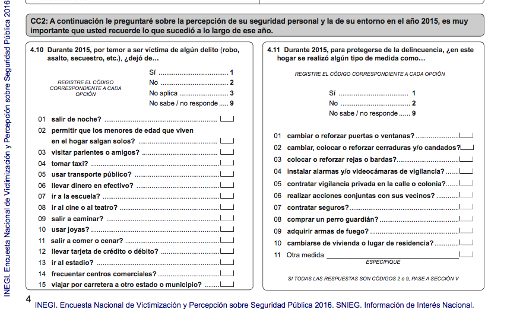

```{r setup, include=FALSE}
knitr::opts_chunk$set(echo = FALSE)

library(psych)
library(stargazer)
```

```{r}
insecure <- read.csv("~/Documents/Psicometria/IRT/envipe_2016_csv/clean_insecure.csv")
# Convierte los si==1, no==0
insecure <- insecure[,-1]
insecure <- -1*(insecure-2)

# Redefinimos las informacion de nuestra base de datos
n_items <- length(insecure[1,])
n_obs <- length(insecure[,1])

insecure_tct <- apply(insecure,1,sum)
```


El objetivo del presente trabajo fue medir la percepción de inseguridad a través de los datos obtenidos de la Encuesta Nacional de Victimización y Percepción sobre Seguridad Pública (ENVIPE) 2016. Para aproximar cuantitativamente el constructo de *percepción de inseguridad*, se utilizó el marco de la Teoría de Respuesta al Item (TRI). Esta teoría nos permite calcular el nivel de percepción de inseguridad de cada persona así como la capacidad que tiene el reactivo para evaluar dicho constructo. Adicionalmente, se obtiene un indicador único de la percepción de inseguridad en el país, el cual puede ser utilizado para una toma de decisiones más eficiente. La TRI fue concevida como una alternativa a la Teoría Clásica de los Tests (TCT) para solucionar diversos problemas. En cuanto a la medición de la percepción de inseguridad del país, se utilizó la ENVIPE que es realizada anualmente por el INEGI con una muestra con representatividad nacional.

##ENVIPE
La ENVIPE consta de diversas secciones de las cuales sólo se tomó la CC2 (Figura 1) para fines del trabajo. La sección CC2 contiene dos sub-cuestionarios; al primero se quitaron las preguntas 07, 08 y 13, debido a que contenían una gran cantidad de respuestas no válidas (no sabe o no responde). Después sólo se tomaron a los participantes que contestaron todas las preguntas en dichos sub-cuestionarios. En total se analizaron 14528 participantes alrededor del país de las 85744 que estaban en la muestra inicial. La respuesta de NO se codificó con 0 y la respuesta SÍ como 1.

{height=200px}


##Teoría Clásica de los Tests 
De acuerdo a esta teoría, cuando las respuesta en un test son dicotómicas, el puntaje del sujeto es la suma de las respuestas correctas. La teoría supone que este puntaje es una función de su habilidad real más un error aleatorio que no depende del sujeto ni del reactivo. Matemáticamente el modelo se representa de la siguiente manera: 
$$
\sum_{j=1}^{k}x_{ij}= T_{i}+\epsilon_{i}
$$
donde $x_{ij}$ toma el valor de 1 cuando el sujeto $i$ respondió correctamente a la pregunta $j$; $T_{i}$ representa la habilidad real del sujeto, la cual se supone es constante; y $\epsilon_{i}$ es el error aleatorio. 

Un problema con la estructura de este modelo es que si se cuenta con sólo una repetición del test no hay forma de calcular la habilidad real del sujeto. Por lo tanto, debe suponerse que bajo una repetición todos los sujetos tienen una misma T, de manera que los errores puedan ser estimados. Otro problema es que en este modelo cada item mide de igual manera la habilidad real, lo cual puede no ser el caso. 

Tradicionalmente, para evaluar un test se calcula el alpha de Crombach la cual mide la consistencia interna del test mediante una cota inferior de la confiabilidad del test. De acuerdo al análisis de la ENVIPE esta alpha resulto ser de 0.88.

```{r, include=FALSE}
alpha_c <- alpha(cov(insecure))
alpha_c <- alpha_c$total
```

```{r, results='asis'}
#colnames(alpha_c)[1] <- c(alpha)
stargazer(alpha_c,summary = F)
```

Sin embargo, el $\alpha$ de Crombach es sólo una medida de confiabilidad del test y no podemos decir nada de los sujetos, ni de los reactivos. 

##Teoría de Respuesta al Item (Modelo de Rasch)

A diferencia de la TCT, en la cual no se puede obtener un estimador del nivel de habilidad de los sujetos ni diferenciar entre reactivos, la TRI es capaz de logarlo. En su forma más simple, esta teoría supone que la probabilidad de responder correctamente a un reactivo es una función de la diferencia entre la habilidad del sujeto y la dificultad del reactivo. La función se representa de la siguiente manera: 

$$
P(x_{ij}=1|\theta_{i},\beta_{j}) = \frac{e^{\theta_i-\beta_j}}{1+e^{\theta_i-\beta_j}}
$$

En donde $\theta_i$ representa la habilidad del sujeto y $\beta_j$ la dificultad del reactivo. En el presente trabajo la habilidad se refiere a la percepción de inseguridad, mientras que la dificultad del reactivo está asociada al nivel de percepción de inseguridad necesario para que un sujeto responda de manera afirmativa a la pregunta con una probabilidad de 0.5. Esto implica que a mayor percepción de inseguridad se espería una mayor cantidad de respuestas afirmativas. A continuación se presenta este análisis. 

#Resultados
La Figura 2. muestra la proporción de personas que contestaron afirmativamente en cada una de las preguntas. El reactivo con la mayor proporción es "dejó de permitir que los menores de edad salieran solos"; seguido por las preguntas, "dejó de usar joyas"" y "dejo de salir de noche". Por otra parte el reactivo "adquirió armas de fuego" tuvo la menor proporción de respuestas afirmativas, seguido por "cambiarse de vivienda". 


##Análisis con Modelo de Rash
En la Figura 3. se puede observar el comportamiento teórico dada la estimación del parámetro $\beta_j$, que para la encuesta realizada implica que para responder afirmativamente a cada pregunta se requiere mayor percepción de inseguridad. Se observa que los Así mismo se observa que los items que implican mayor percepción de inseguridad tienen menor probabilidad de ser respondidos para las personas que de hecho perciben mayor inseguridad. 

La Figura 4. se observan las proporciones de personas que respondieron que si dado su valor de theta. En este gráfico los que implican mayor percepción de inseguridad (mayor dificultad) tienen el color rojo más concentrado y viceversa para los que implican menor percepción. En este gráfico es más claro que los items con mayor dificultad tienen menor proporción de personas que afirmaron las preguntas dado que tienen mayor percepción de inseguridad. 

Por último la figura 5. tiene 21 sub-graficos cada uno representa dado un único parámetro de theta la proporción de afirmaciones en cada uno de los items, los cuales se encuentran ordenados del más fácil al más difícil (menor percepción de inseguridad a mayor percepción de inseguridad). En este se observa que para el valor más pequeño de theta la proporción de afirmaciones en todos los items es de cero. Conforme incrementa el valor de theta se van aumentando las proporciones para los items que implican menor percepción de inseguridad. Cabe de notar, que incluso para las thetas que tienen mayor valor, los items más difíciles tienen muy poca proporción de afirmaciones. 

#Discusión
Los resultados indican que los items que contienen mayor percepción de inseguridad pueden estár mal calibrados debido a que no necesariamente con mayor valor del atributo de interés la probabilidad de responder incremente. Contextualmente puede indicar que los items con mayor percepción de inseguridad, no necesariamente lo son para todos los participantes. 


